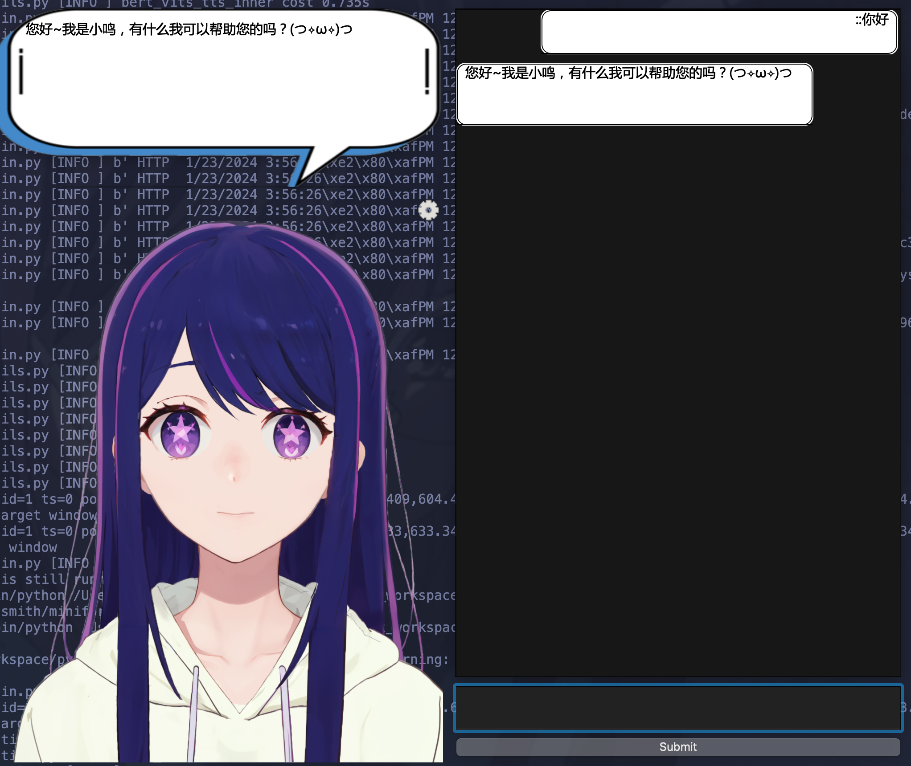

# pyqt-live2d-chat

## 1. 概述

本项目是一个基于 `PySide6`和 `Live2D` 的聊天应用。它提供了一个图形界面，用户可以与 `Live2D` 模型进行实时对话, `LLM` 模型支持 `Gemini`, `Azure GPT`, `Openai GPT`。

核心是使用`Qt`的`Webview`展示`live2d`的`Web SDK`模型. 

## 2. 页面展示
### 2.1 基础设置页面:

### 2.2 对话页面:

## 3. 安装和运行

### 3.1 配置文件
本项目配置通过环境变量实现
首先复制 `.env.sample` 为 `.env`
配置具体参考代码与配置文件的注释.

### 3.2 依赖框架

* Python3
* Node

### 3.3 本地运行
1. 克隆项目到本地：`git clone git@github.com:JhonSmith0x7b/pyqt-live2d-chat.git -recurse`
2. 进入项目目录：`cd pyqt-live2d-chat`
3. 安装依赖：`pip install -r requirements.txt`
4. 运行应用：`python main.py`
5. 如果使用本地live2d, 需要运行 `cd ./live2d/Samples/TypeScript/Demo/ && npm run build && npm run serve`

### 3.4 打包运行
1. windows 使用 `build_main.ps1` 进行pyinstaller打包exe程序.

## 4. 文件结构

- `main.py`: 应用的入口文件，包含了应用的主要逻辑。
- `./live2d/`: Live2D 代码, 从 Web SDK Demo 修改而来.
- `./llms/`: llm 代码
- `./ttss/`: tts 代码
- `./prompts/`: llm 指示文件
- `./resources/`: 存放了应用所需的资源文件，如 Live2D 模型和背景图片。

## 5. 支持项目

- Live2D https://github.com/Live2D/CubismWebSamples
- 免费模型 https://koiyume233.booth.pm/

## 6. Q&A

### 6.1 如何添加live2D模型
复制模型文件夹到 `./live2d/Resources/`, 修改 `./live2d/Samples/TypeScript/Demo/src/lappdefine.ts` 的 `ModelDir`, 将模型文件夹名称加入里面, npm 重新打包.